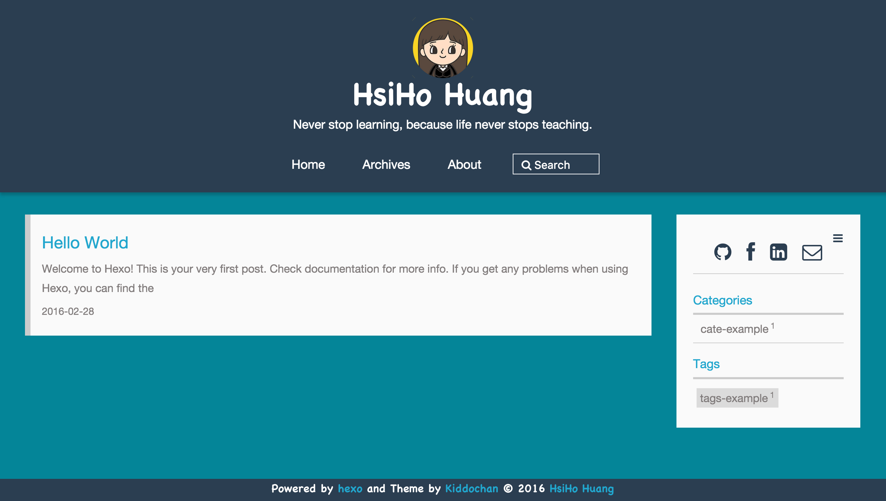
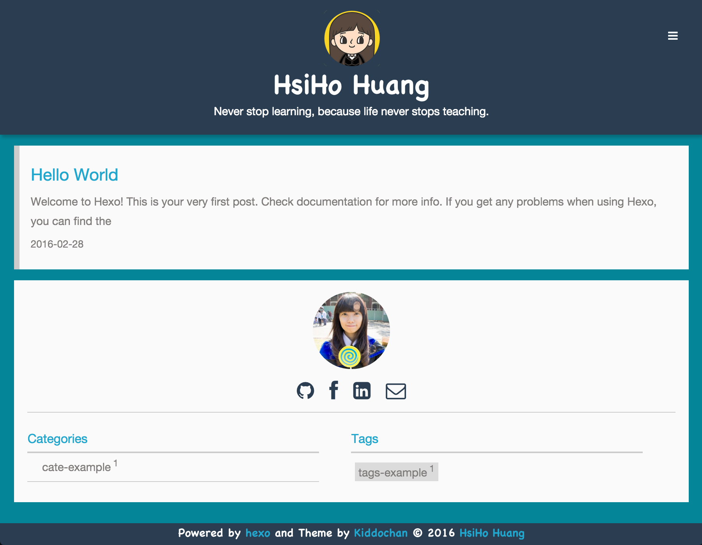
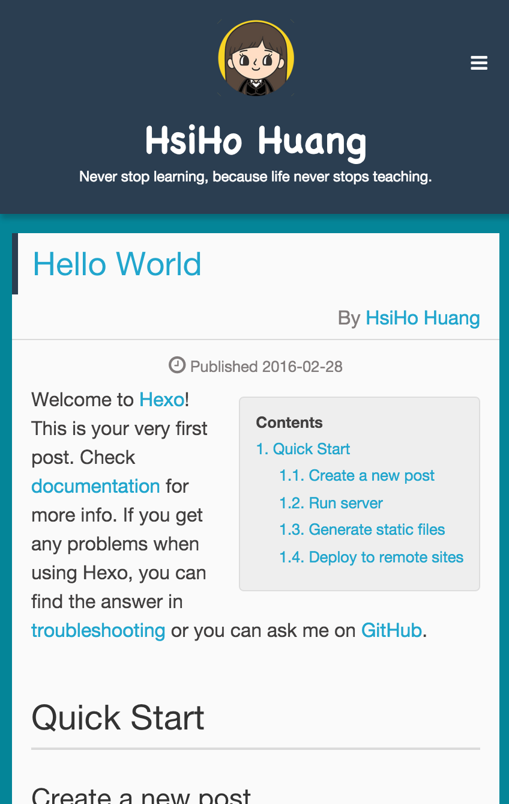
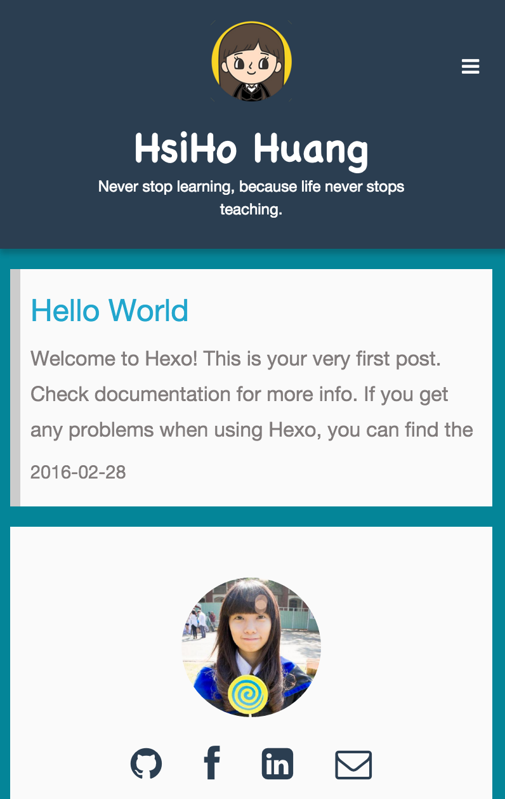
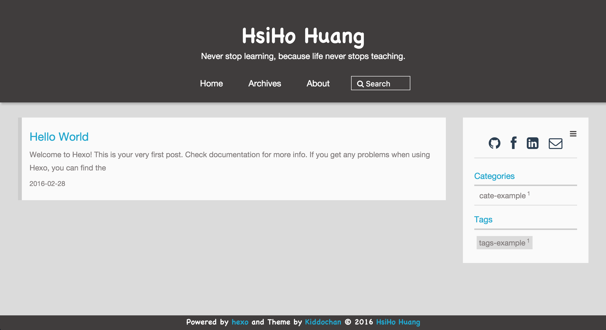
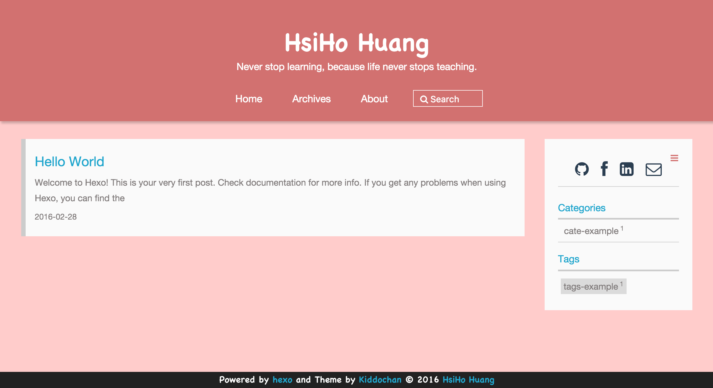
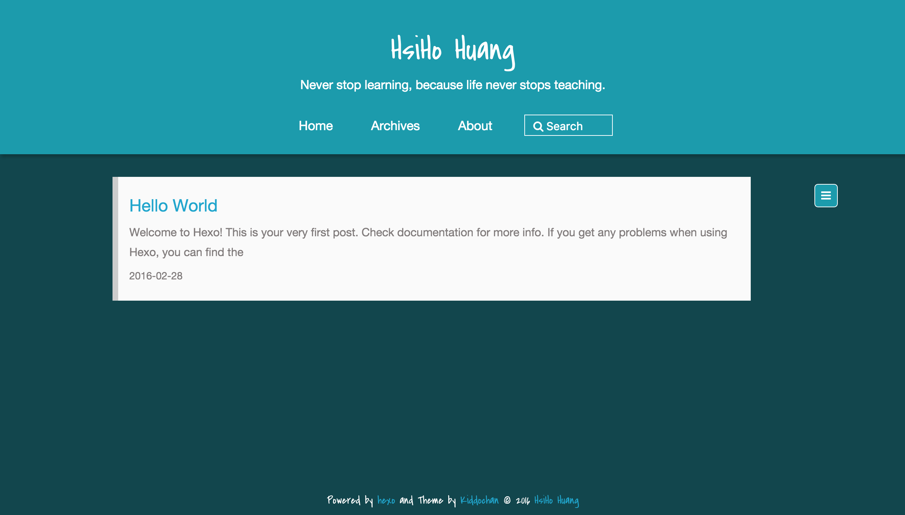
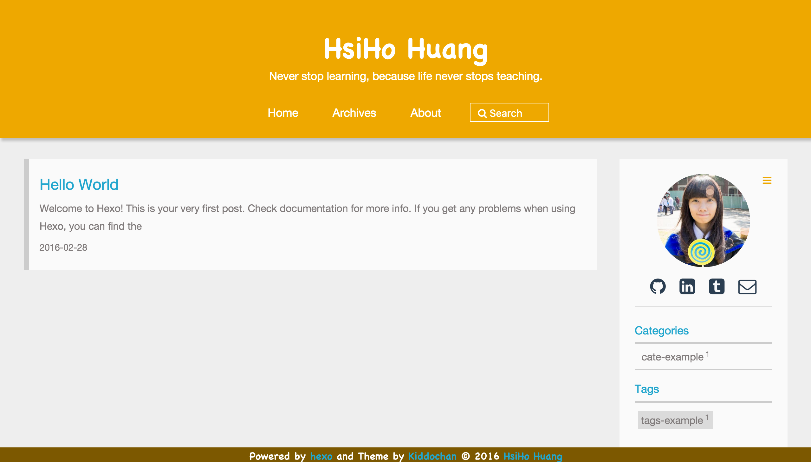
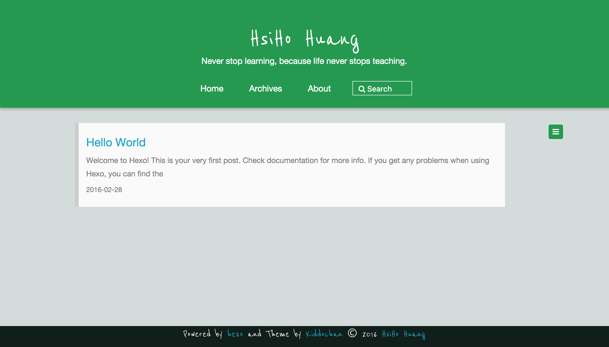

# Kiddochan

[中文Readme](/README_zh.md)

Kiddochan is a simple, flexible and responsive theme for [Hexo](http://hexo.io) based on [Jacman](https://github.com/wuchong/jacman). Some custom theme examples are at the bottom. 

[More about Kiddochan](http://blog.hsihohuang.info/tags/Kiddochan/) 

[Demo](http://blog.hsihohuang.info) 

##Screenshots
### PC


### Pad


### Phone



##Installation
###Install
```
$ git clone https://github.com/hsihohuang/kiddochan.git themes/kiddochan
```
**Kiddochan requires Hexo 2.7 and above.** 
###Enable
Modify `theme` setting in blog folder` _config.yml` to `kiddochan`.
###Update
```
cd themes/kiddochan
git pull origin master
```
**please backup your `_config.yml` file before update.** 

##Configuration

Modify settings in  `/themes/kiddochan/_config.yml`.

```yml
##### Menu
menu:
  Home: /
  Archives: /archives
  About: /about
## you can create `tags` and `categories` folders in `../source`.
## And create a `index.md` file in each of them.
## set `front-matter`as
## layout: tags (or categories)
## title: tags (or categories)
## --
## To create your "about" page, you can run the command "$ hexo new page about" 
## under your hexo dir and then you can modify your about page in `source/about/index.md`
## ---

#### Widgets
widgets: 
- category
- tag
#- links
#- douban
#- rss
#- weibo
#- github-card
  ## provide eight widgets:github-card,category,tag,rss,archive,tagcloud,links,weibo

#### RSS 
rss: atom.xml ## RSS address.

#### Image
imglogo:
  enable: true             ## display image logo true/false.
  src: img/logo.png        ## `.svg` and `.png` are recommended,please put image into the theme folder `/kiddochan/source/img`.
favicon: img/unnamed4_n_mSY_icon.ico   ## size:32px*32px,`.ico` is recommended,please put image into the theme folder `/kiddochan/source/img`.     
apple_icon: img/profile.png ## size:114px*114px,please put image into the theme folder `/kiddochan/source/img`.
author_img: img/author.jpg ## size:220px*220px.display author avatar picture.if don't want to display,please don't set this.
banner_img: #img/banner.jpg ## size:1920px*200px+. Banner Picture

### Theme Color
# you can change theme color quickly here. if you want to use the default colors, just don't set them.
theme_color:
    theme: ''       ## default: '#2c3e50'
    background: ''  ## default: '#158597'
    footer: ''      ## default: '#2c3e50'

### Font Style
Font-style: cute
## you can choose: default, cute , cool , custom   
## Note: default custom font is "ReenieBeanie", you can change this to yours
## if you want to change the default custom font, you have to add custom font files(.woff2, .woff, .ttf, .eot) in `kiddochan/source/font`
## (you can use [this tool](http://www.fontsquirrel.com/tools/webfont-generator) to generate your web font)
## and then change font-custom-family & font-custom-filename in `variable.styl` which in the theme folder `/kiddochan/source/css/_base`. 


# code highlight theme
# available: default | night
highlight_theme: default

#### index post is expanding or not 
index:
  expand: false           ## default is unexpanding,so you can only see the short description of each post.
  excerpt_link: Read More  

close_aside: false  #close sidebar in post page if true
mathjax: false      #enable mathjax if true

### Creative Commons License Support, see http://creativecommons.org/ 
### you can choose: by , by-nc , by-nc-nd , by-nc-sa , by-nd , by-sa , zero
creative_commons: 

#### Author information
author:
  weibo:      ## e.g. wuchong1014 or 2176287895 for http://weibo.com/2176287895
  weibo_verifier:    ## e.g. b3593ceb Your weibo-show widget verifier ,if you use weibo-show it is needed.
  tsina:      ## e.g. 2176287895  Your weibo ID,It will be used in share button.
  douban:     ## e.g. wuchong1014 or your id for https://www.douban.com/people/wuchong1014
  zhihu:      ## e.g. jark  for http://www.zhihu.com/people/jark
  email: hsihohuang@hotmail.com     ## e.g. hsihohuang@hotmail.com
  twitter:    ## e.g. jarkwu for https://twitter.com/jarkwu
  github: hsihohuang    ## e.g. hsihohuang for https://github.com/hsihohuang
  facebook:   ## e.g. imjark for https://facebook.com/imjark
  linkedin:   ## e.g. wuchong1014 for https://www.linkedin.com/in/wuchong1014
  google_plus:    ## e.g. "111190881341800841449" for https://plus.google.com/u/0/111190881341800841449, the "" is needed!
  stackoverflow:  ## e.g. 3222790 for http://stackoverflow.com/users/3222790/jark
  tumblr: hsihohuang    ## e.g. hsihohuang for http://hsihohuang.tumblr.com/

#### Toc
toc:
  article: true   ## show contents in article.
  aside: true     ## show contents in aside.
## you can set both of the value to true of neither of them.
## if you don't want display contents in a specified post,you can modify `front-matter` and add `toc: false`.

#### Links 
links:
  link1's name: link1's url  
  #link2's name: link2's url  

#### Comment
duoshuo_shortname:    ## e.g. hsihohuang   your duoshuo short name.
disqus_shortname:     ## e.g. hsihohuang   your disqus short name.

#### Share button
jiathis:
  enable: false ## if you use jiathis as your share tool,the built-in share tool won't be display.
  id:    ## e.g. 1889330 your jiathis ID. 
  tsina: ## e.g. 2176287895 Your weibo id,It will be used in share button.


#### Analytics
google_analytics:
  enable: false
  id:        ## e.g. UA-72527374-4 your google analytics ID.
  site:      ## e.g. blog.hsihohuang.info your google analytics site or set the value as auto.
## You MUST upgrade to Universal Analytics first!
## https://developers.google.com/analytics/devguides/collection/upgrade/?hl=zh_CN
baidu_tongji:
  enable: false
  sitecode:  ## e.g. e6d1f421bbc9962127a50488f9ed37d1 your baidu tongji site code
cnzz_tongji:
  enable: false
  siteid:    ## e.g. 1255875723 your cnzz tongji site id

#### Miscellaneous
fancybox: true        ## if you use gallery post or want use fancybox please set the value to true.
totop: true           ## if you want to scroll to top in every post set the value to true


#### Custom Search
google_cse: 
  enable: false
  cx:   ## e.g. 003570875242930637062:df_fexfhicw your Custom Search ID.
## https://www.google.com/cse/ 
## To enable the custom search You must create a "search" folder in '/source' and a "index.md" file
## set the 'front-matter' as
## layout: search 
## title: search
## ---
baidu_search:     ## http://zn.baidu.com/
  enable: false
  id:   ## e.g. "783281470518440642"  for your baidu search id
  site:   ## your can change to your site instead of the default site
  
tinysou_search:     ## http://tinysou.com/
  enable: false
  id:  ## e.g. "4ac092ad8d749fdc6293" for your tiny search id
```

##Some custom theme examples
### Example 1
theme: '#403D3D'       
background: '#DBDBDB'  
footer: '#403D3D' <br>
Font-style: cool


### Example 2
theme: '#D07272'       
background: '#FCC'  
footer: '#4A4848' <br>
Font-style: cute


### Example 3
theme: '#279BAB'       
background: '#15464C'  
footer: '#15464C' <br>
Font-style: cool


### Example 4
theme: '#ECA70C'       
background: '#EEE'  
footer: '#7B5705' <br>
Font-style: cute


### Example 5
theme: '#2D9853'       
background: '#D3DCDA'  
footer: '#111F1A' <br>
Font-style: custom <br>
**Note: default custom font is "ReenieBeanie", you can change this to yours.**
**If you want to change the default custom font, you have to add custom font files(.woff2, .woff, .ttf, .eot) in `kiddochan/source/font` 
(you can use [this tool](http://www.fontsquirrel.com/tools/webfont-generator) to generate your web font)**
**and then change font-custom-family & font-custom-filename in `variable.styl` which in the theme folder `/kiddochan/source/css/_base`.**


##Google custom search page
##### Example(Search: quicksort)


##License
[MIT](/LICENSE)
